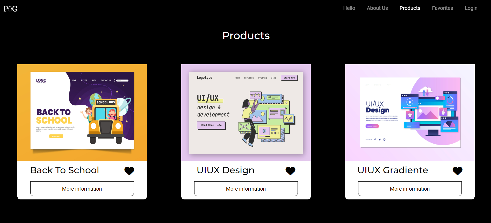

# PINGIDEV

PinGiDev es una empresa ficticia especializada en la creación y venta de sitios web, con un enfoque en diseños minimalistas y elegantes 
que priorizan tanto la estética como la funcionalidad. La plataforma cuenta con una interfaz pública, accesible para los usuarios, y una
sección privada diseñada específicamente para que los empleados gestionen las tareas administrativas de forma eficiente y segura.

Este proyecto combina diversas tecnologías. En el backend, se utiliza PHP junto con el framework Symfony, ya que durante el segundo curso 
del ciclo de Desarrollo de Aplicaciones Web me familiaricé con esta tecnología y resultaba lo más óptimo para el proyecto. Para el frontend, 
se emplean tecnologías clásicas como HTML5 y CSS3, complementadas con componentes de Bootstrap que facilitaron el trabajo realizado.

